# Undefined データベースERD図

> 本番環境: Supabase PostgreSQL
> 生成日: 2026-01-07

## 概要

Undefinedプラットフォームは5つのブロックチェーン（BTC, ETH, XRP, TRON, Cardano）に対応した暗号資産取引プラットフォームです。
このERD図は、システムの主要テーブルとその関係性を示しています。

## ERD図（完全版）

```mermaid
erDiagram
    %% ===== 認証・ユーザー管理 =====
    auth_users {
        uuid id PK
        text email
        timestamptz created_at
    }

    profiles {
        uuid id PK,FK "auth.users.id"
        text full_name
        text user_handle UK
        text display_name
        text bio
        boolean is_public
        text kyc_status "pending|approved|rejected"
        text phone_number
        timestamptz created_at
        timestamptz updated_at
    }

    user_roles {
        uuid id PK
        uuid user_id FK "auth.users.id"
        text role "admin|moderator|user"
        timestamptz created_at
    }

    %% ===== 資産管理 =====
    user_assets {
        uuid id PK
        uuid user_id FK "auth.users.id"
        text asset "BTC|ETH|USDT|XRP|TRX|ADA"
        numeric balance
        numeric locked_balance
        timestamptz created_at
        timestamptz updated_at
    }

    ledger_entries {
        uuid id PK
        uuid user_id FK "auth.users.id"
        text currency
        numeric amount
        numeric locked_delta
        text kind "order_lock|trade_fill|deposit|withdrawal|fee|adj"
        text ref_type "order|trade|deposit|withdrawal|system"
        uuid ref_id
        timestamptz created_at
    }

    %% ===== 入金システム =====
    deposits {
        uuid id PK
        uuid user_id FK "auth.users.id"
        text currency
        numeric amount
        text status "pending|confirmed|failed"
        text tx_hash
        integer confirmations_required
        integer confirmations_observed
        timestamptz created_at
    }

    deposit_addresses {
        uuid id PK
        uuid user_id FK "auth.users.id"
        text chain "evm|btc|xrp|trc|ada"
        text network "ethereum|bitcoin|mainnet|testnet"
        text asset
        text address
        text memo_tag
        text destination_tag
        text derivation_path
        integer address_index
        text xpub
        boolean active
        timestamptz created_at
    }

    deposit_transactions {
        uuid id PK
        uuid user_id FK "auth.users.id"
        uuid deposit_address_id FK
        text chain
        text network
        text asset
        text transaction_hash
        bigint block_number
        text from_address
        text to_address
        numeric amount
        integer confirmations
        integer required_confirmations
        text status "pending|confirmed|failed"
        text destination_tag
        timestamptz detected_at
        timestamptz confirmed_at
    }

    chain_configs {
        uuid id PK
        text chain
        text network
        text asset
        boolean deposit_enabled
        integer min_confirmations
        numeric min_deposit
        timestamptz created_at
    }

    xrp_fixed_addresses {
        uuid id PK
        text network
        text address UK
        boolean active
        timestamptz created_at
    }

    %% ===== 出金システム =====
    withdrawals {
        uuid id PK
        uuid user_id FK "auth.users.id"
        text currency
        numeric amount
        text address
        text status "pending|approved|processing|completed|rejected"
        text tx_hash
        timestamptz created_at
        timestamptz processed_at
    }

    %% ===== 取引システム =====
    markets {
        text id PK "BTC-USDT"
        text base
        text quote
        numeric price_tick
        numeric qty_step
        numeric min_notional
        text status "active|paused|disabled"
        timestamptz created_at
    }

    orders {
        uuid id PK
        uuid user_id FK "auth.users.id"
        text market FK "markets.id"
        text side "buy|sell"
        text type "limit|market"
        numeric price
        numeric qty
        numeric filled_qty
        text status "new|open|partially_filled|filled|canceled"
        text time_in_force "GTC|IOC|FOK"
        boolean post_only
        timestamptz created_at
    }

    trades {
        uuid id PK
        text market FK "markets.id"
        uuid taker_order_id FK "orders.id"
        uuid maker_order_id FK "orders.id"
        numeric price
        numeric qty
        numeric taker_fee
        numeric maker_fee
        timestamptz created_at
    }

    %% ===== ユーザー間送金 =====
    user_transfers {
        uuid id PK
        uuid from_user_id FK "auth.users.id"
        uuid to_user_id FK "auth.users.id"
        text currency
        numeric amount
        text status "pending|completed|failed|cancelled"
        text transaction_hash UK
        text reference_number UK
        text description
        timestamptz created_at
        timestamptz completed_at
    }

    transfer_limits {
        uuid id PK
        uuid user_id FK "auth.users.id"
        text currency
        numeric daily_limit
        numeric monthly_limit
        numeric single_transfer_limit
        boolean is_active
        timestamptz created_at
    }

    %% ===== 紹介システム =====
    referral_codes {
        uuid id PK
        uuid user_id FK,UK "auth.users.id"
        text code UK
        boolean is_active
        integer max_uses
        integer current_uses
        timestamptz expires_at
        timestamptz created_at
    }

    referrals {
        uuid id PK
        uuid referrer_id FK "auth.users.id"
        uuid referred_id FK,UK "auth.users.id"
        text referral_code
        text status "pending|active|completed"
        timestamptz created_at
        timestamptz completed_at
    }

    referral_rewards {
        uuid id PK
        uuid referral_id FK "referrals.id"
        uuid user_id FK "auth.users.id"
        text reward_type "referrer_bonus|referred_bonus|milestone_bonus"
        text currency
        numeric amount
        text status "pending|awarded|cancelled"
        timestamptz awarded_at
        timestamptz created_at
    }

    %% ===== 運用管理 =====
    admin_wallets {
        uuid id PK
        text chain
        text network
        text asset
        text address
        boolean active
        timestamptz created_at
    }

    sweep_jobs {
        uuid id PK
        uuid deposit_id FK "deposits.id"
        text chain
        text network
        text asset
        text from_address
        text to_address
        numeric planned_amount
        text currency
        text status "planned|signed|broadcasted|confirmed|failed"
        jsonb unsigned_tx
        text signed_tx
        text tx_hash
        text error_message
        timestamptz created_at
    }

    audit_logs {
        uuid id PK
        uuid actor_user_id FK "auth.users.id"
        text action
        text entity_type
        uuid entity_id
        jsonb metadata
        timestamptz created_at
    }

    %% ===== 通知・サポート =====
    notifications {
        uuid id PK
        uuid user_id FK "auth.users.id"
        text type
        text title
        text message
        boolean is_read
        jsonb metadata
        timestamptz created_at
    }

    support_tickets {
        uuid id PK
        uuid user_id FK "auth.users.id"
        text subject
        text message
        text status "open|in_progress|resolved|closed"
        text priority "low|medium|high|urgent"
        timestamptz created_at
        timestamptz resolved_at
    }

    %% ===== リレーションシップ =====
    auth_users ||--|| profiles : "has profile"
    auth_users ||--o{ user_roles : "has roles"
    auth_users ||--o{ user_assets : "owns assets"
    auth_users ||--o{ ledger_entries : "has ledger"
    auth_users ||--o{ deposits : "makes deposits"
    auth_users ||--o{ withdrawals : "makes withdrawals"
    auth_users ||--o{ deposit_addresses : "has addresses"
    auth_users ||--o{ deposit_transactions : "receives txs"
    auth_users ||--o{ orders : "places orders"
    auth_users ||--o{ user_transfers : "sends transfers"
    auth_users ||--o{ user_transfers : "receives transfers"
    auth_users ||--o{ transfer_limits : "has limits"
    auth_users ||--|| referral_codes : "has referral code"
    auth_users ||--o{ referrals : "refers users"
    auth_users ||--o| referrals : "is referred by"
    auth_users ||--o{ referral_rewards : "earns rewards"
    auth_users ||--o{ notifications : "receives"
    auth_users ||--o{ support_tickets : "creates"
    auth_users ||--o{ audit_logs : "triggers audits"

    deposit_addresses ||--o{ deposit_transactions : "receives"

    markets ||--o{ orders : "has orders"
    markets ||--o{ trades : "has trades"

    orders ||--o{ trades : "is taker"
    orders ||--o{ trades : "is maker"

    deposits ||--o| sweep_jobs : "triggers sweep"

    referrals ||--o{ referral_rewards : "generates"
```



## テーブル概要

### 認証・ユーザー管理（3テーブル）

| テーブル | 説明 | RLS |
|---------|------|-----|
| `auth.users` | Supabase認証ユーザー（システム管理） | - |
| `profiles` | ユーザープロファイル（KYC状態、表示名等） | ✅ |
| `user_roles` | ロール管理（admin/moderator/user） | ✅ |

### 資産管理（2テーブル）

| テーブル | 説明 | RLS |
|---------|------|-----|
| `user_assets` | ユーザー資産残高（通貨別） | ✅ |
| `ledger_entries` | 不変台帳（取引履歴の真実のソース） | ✅ |

### 入金システム（5テーブル）

| テーブル | 説明 | RLS |
|---------|------|-----|
| `deposits` | 入金記録（確認数追跡） | ✅ |
| `deposit_addresses` | ユーザー入金アドレス（HD派生） | ✅ |
| `deposit_transactions` | 検知トランザクション | ✅ |
| `chain_configs` | チェーン設定（確認数、最小入金額） | ✅ |
| `xrp_fixed_addresses` | XRP固定アドレス（Destination Tag方式） | ✅ |

### 出金システム（1テーブル）

| テーブル | 説明 | RLS |
|---------|------|-----|
| `withdrawals` | 出金リクエスト・処理状況 | ✅ |

### 取引システム（3テーブル）

| テーブル | 説明 | RLS |
|---------|------|-----|
| `markets` | 取引ペア（BTC-USDT等） | ✅ |
| `orders` | 注文（指値/成行） | ✅ |
| `trades` | 約定記録 | ✅ |

### ユーザー間送金（2テーブル）

| テーブル | 説明 | RLS |
|---------|------|-----|
| `user_transfers` | プラットフォーム内送金 | ✅ |
| `transfer_limits` | 送金限度額（日次/月次/1回） | ✅ |

### 紹介システム（3テーブル）

| テーブル | 説明 | RLS |
|---------|------|-----|
| `referral_codes` | 紹介コード（ユーザーごとに一意） | ✅ |
| `referrals` | 紹介関係追跡 | ✅ |
| `referral_rewards` | 報酬配布記録 | ✅ |

### 運用管理（3テーブル）

| テーブル | 説明 | RLS |
|---------|------|-----|
| `admin_wallets` | 管理用集約ウォレット | ✅ |
| `sweep_jobs` | スイープ（集約送金）ジョブ | ✅ |
| `audit_logs` | 監査ログ | ✅ |

### 通知・サポート（2テーブル）

| テーブル | 説明 | RLS |
|---------|------|-----|
| `notifications` | ユーザー通知 | ✅ |
| `support_tickets` | サポートチケット | ✅ |

## セキュリティ設計

### Row Level Security (RLS) ポリシー

全テーブルでRLSが有効化されており、以下のパターンを採用:

1. **ユーザー自身のデータ**: `auth.uid() = user_id` で本人のみアクセス可
2. **管理者権限**: `has_role(auth.uid(), 'admin')` で管理者は全データにアクセス可
3. **公開データ**: `markets`, `trades` は誰でも閲覧可（市場データ）

### 制約とバリデーション

```sql
-- 自己送金防止
CONSTRAINT no_self_transfer CHECK (from_user_id != to_user_id)

-- 金額検証
CONSTRAINT positive_amount CHECK (amount > 0)

-- ステータス列挙
CONSTRAINT valid_status CHECK (status IN ('pending', 'confirmed', 'failed'))
```

## チェーン別対応状況

| チェーン | chain値 | network例 | 対応トークン |
|---------|---------|-----------|-------------|
| Bitcoin | `btc` | `mainnet`, `testnet` | BTC |
| Ethereum | `evm` | `ethereum`, `sepolia` | ETH, USDT(ERC20) |
| XRP Ledger | `xrp` | `mainnet`, `testnet` | XRP |
| TRON | `trc` | `mainnet`, `shasta` | TRX, USDT(TRC20) |
| Cardano | `ada` | `mainnet`, `testnet` | ADA |

## 関連ドキュメント

- [データベーススキーマ詳細](../04-database-schema.md)
- [マルチチェーン入金仕様](../12-multichain-deposit-spec.md)
